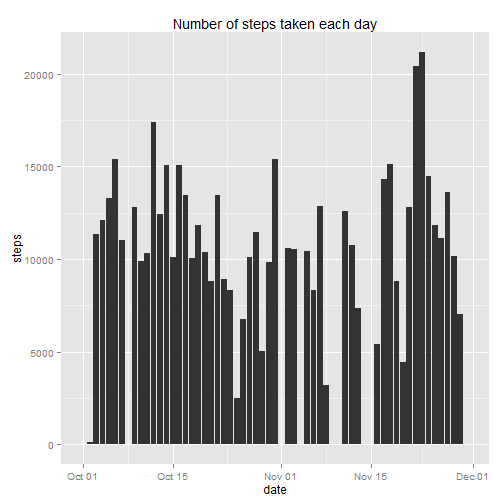
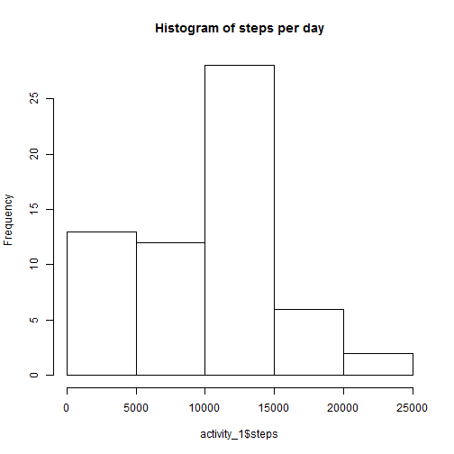
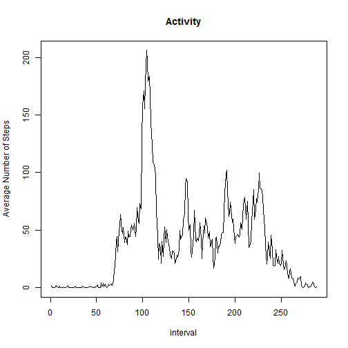
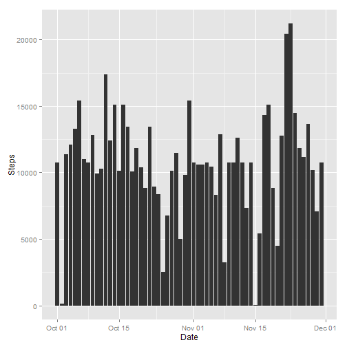
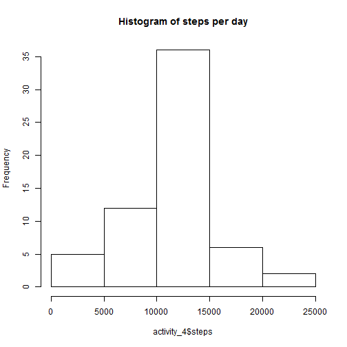
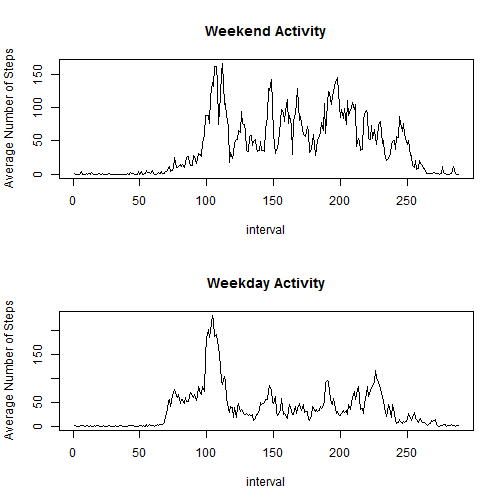
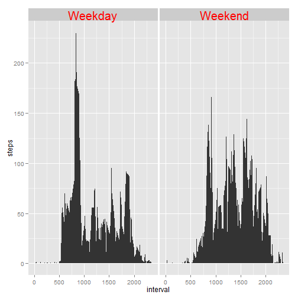

Activity Monitor - Assignment 1 for Reproducible Reasearch
========================================================


Loading and preprocessing the data
--------------------------------------------------------

We first load in the data with a simple call to "read.csv". 


```r
activity <- read.csv("./repro/activity.csv")
```

The data had three columns, two of which might be candidates for processing - the date and the interval columns.  I've decided to just process the dates into date formats for now as that adds clarity for charting later in this exercise.  Modifying the intervals does not add as much value.


```r
activity$date <- as.Date(activity$date)
```

What is the mean total of steps taken per day?
--------------------------------------------------------

There was some discussion in the forums about what constitutes a histogram of steps per day.  It could be interpreted as either the frequency of numbers of steps per day (like 500 steps were taken on two days, 600 on three days, etc...) or as a profile of how many steps were taked on each day in the sequence.  I've chose to illustrate the both of those options, starting with the second (after i load the libraries): 


```r
library(ggplot2)
library(dplyr)
```

```
## 
## Attaching package: 'dplyr'
## 
## The following objects are masked from 'package:stats':
## 
##     filter, lag
## 
## The following objects are masked from 'package:base':
## 
##     intersect, setdiff, setequal, union
```

```r
activity_1 <- group_by(activity,date)
activity_1 <- summarise(activity_1, steps = sum(steps, na.rm=TRUE))
activity_1 <- data.frame(activity_1)
ggplot(activity_1, aes(date,steps)) + geom_bar(stat = "identity") + ggtitle("Number of steps taken each day")
```

 

And now for the other intepretation:


```r
hist(activity_1$steps, main = "Histogram of steps per day")
```

 

Then we look at the mean and median steps per day:


```r
summarise(activity, mean = mean(steps, na.rm = TRUE))
```

```
##    mean
## 1 37.38
```

```r
summarise(activity, median = median(steps, na.rm = TRUE))
```

```
##   median
## 1      0
```


What is the average daily activity pattern?
--------------------------------------------------------

We first group our data by interval before finding the mean data per interval and plotting it: 


```r
activity_2 <- group_by(activity,interval)
activity_2 <- summarise(activity_2, steps = mean(steps, na.rm=TRUE))
activity_2 <- data.frame(activity_2)
plot(activity_2$steps,type='l',ylab = "Average Number of Steps", xlab = "interval", main = "Activity")
```

 

The interval with the greatest number of steps on average is:


```r
activity_2[which(activity_2$steps == max(activity_2$steps)),]
```

```
##     interval steps
## 104      835 206.2
```


Imputing missing values
--------------------------------------------------------

Calculating the nubmer of NA's in the data set is easy:


```r
sum(is.na(activity$steps))
```

```
## [1] 2304
```

Then we replace the NA values in our dataset with the average for the intervals which they are part of.  We use the data from the activity_2 dataset which we created earlier for this, since we already summarised the average per day there.


```r
for(i in 1:17568) {
        if(is.na(activity[i,1])) {activity[i,1] <- activity_2[which(activity_2[,1] == activity[i,3]),2]}
}
```

Similarly to above there are two ways to interpret the question of a histrogram here, so we'll again look at the two different graphs, in the same order as before. First, the steps per day:


```r
activity_4 <- group_by(activity,date)
activity_4 <- summarise(activity_4, steps = sum(steps, na.rm=TRUE))
activity_4 <- data.frame(activity_4)
ggplot(activity_4, aes(date,steps)) + geom_bar(stat = "identity") + ylab("Steps") + xlab("Date")
```

 

The the other method:


```r
hist(activity_4$steps, main = "Histogram of steps per day")
```

 


The look at the mean and median steps per day


```r
summarise(activity, mean = mean(steps, na.rm = TRUE))
```

```
##    mean
## 1 37.38
```

```r
summarise(activity, median = median(steps, na.rm = TRUE))
```

```
##   median
## 1      0
```

So the median and mean are the same - though both versions of the histograms look quite different.  I reckon this is probably down to the fact that we were ignoring the N/A values, so using average values to impute must maintain the average. Or some other neat magical maths :-)

Are there differences in activity patterns between weekdays and weekend?
--------------------------------------------------------

First i'm going to add a column that hold data on which day of the week a date is. 


```r
activity <- mutate(activity, day = weekdays(activity$date))
```

Then i'm going to replace those days of the week with a weekday | weekend factor. 


```r
activity$day[activity$day == "Sunday" | activity$day ==  "Saturday"] <- "Weekend"
activity$day[activity$day != "Weekend"] <- "Weekday"
activity$day <- as.factor(activity$day)
```

Now we create a panel plot for the data we want to see:


```r
activity_5 <- group_by(activity,interval,day)
activity_5 <- summarise(activity_5, steps = mean(steps, na.rm=TRUE))
activity_5 <- data.frame(activity_5)
par(mfrow = c(2,1))
plot(subset(activity_5$steps, activity_5$day == "Weekend"),type='l',ylab = "Average Number of Steps", xlab = "interval", main = "Weekend Activity")
plot(subset(activity_5$steps, activity_5$day == "Weekday"),type='l',ylab = "Average Number of Steps", xlab = "interval", main = "Weekday Activity")
```

 

```r
par(mfrow = c(1,1))
```

And let's do this last part with ggplot as well for the fun of it. 


```r
ggplot(activity_5, aes(interval,steps)) + geom_area(stat = "identity") + facet_wrap(~ day) + theme(strip.text.x = element_text(size = 20, colour = "red", angle = 0))
```

 
